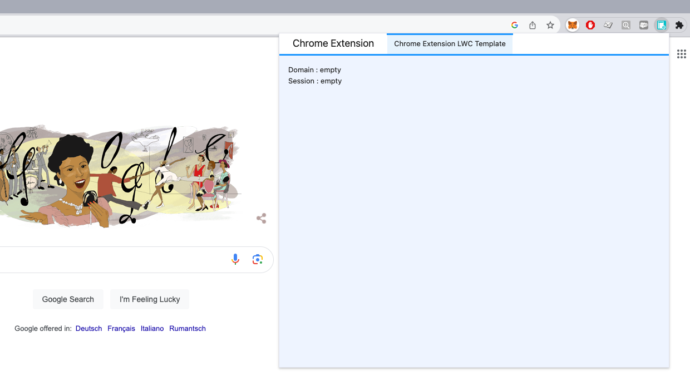

# Chrome Extension LWC Template

This repository serves as a comprehensive template for developing Chrome extensions using the Lightning Web Components (LWC) framework provided by Salesforce.
Empower your Chrome browsing experience by leveraging the robust capabilities of LWC within the extension ecosystem.

## Features
- **Leverage Lightning Web Components**: Harness the power of LWC, Salesforce's cutting-edge framework, to build powerful and intuitive user interfaces within your Chrome extension.
- **Modular Structure**: Benefit from a well-organized, modular codebase that promotes scalability and maintainability.
- **Scaffolded Project Setup**: Get started quickly with a pre-configured project structure and essential files to kickstart your Chrome extension development.
- **Easy Configuration**: Customize and tailor the extension to your specific requirements with easy-to-understand configuration options.

## Getting Started
Follow these simple steps to get up and running with your LWC Chrome extension:

1. Clone the repo.
2. Run `npm install`
3. Run `npm run dev` to run it with a watcher
4. Open `chrome://extensions/`.
5. Enable `Developer mode`.
6. Click `Load unpacked extension...`.
7. Select the folder `dist` that contain the built version

## Build
1. Run `npm run build`
2. Export the `dist` folder that represent your package

## LWC modules
LWC components are stored under the path `client/modules`.

## Global CSS access
LWC is using Shadow dom and it's preventing the components to use the "global" css styling (such as SLDS style) added in the index.html file.\
To have access to this styling, `import '@lwc/synthetic-shadow';` has been added to the `main.js` file.

## Contributing
Contributions are welcome! If you find any issues or have ideas to enhance this template, feel free to submit a pull request. 

## License
This project is licensed under the MIT License. You are free to modify and distribute the code as per the terms mentioned in the license.